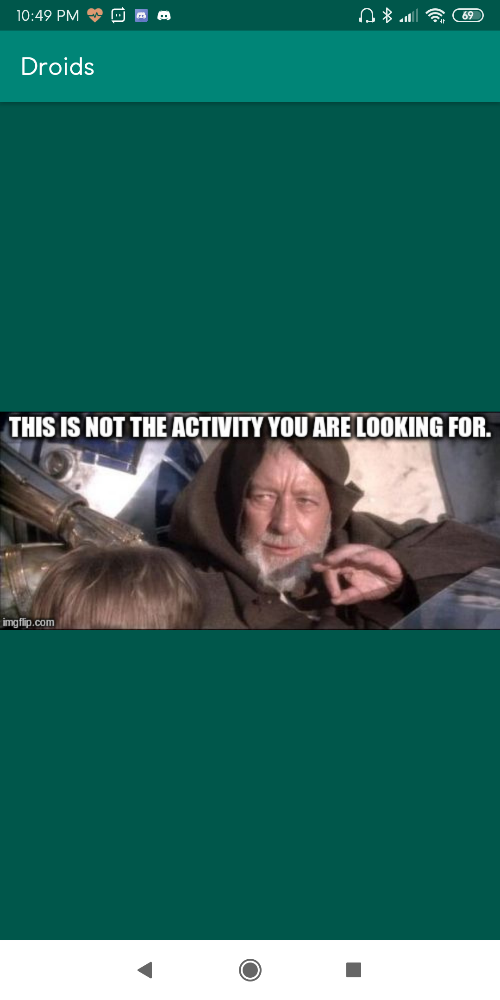
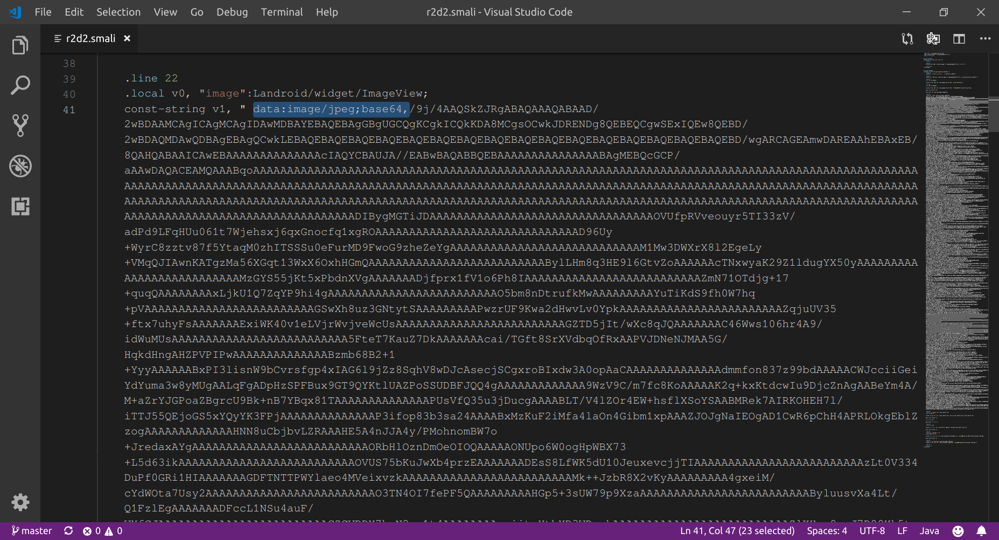

# BSidesSF CTF 2019 writeup(BSides San Francisco CTF)

## https://ctf.bsidessf.net/challenges/ 

### Challenge: Blink(for 50 points)

### Team: <a href="https://ctftime.org/team/72103">Abs0lut3Pwn4g3</a>

    Description

    Get past the Jedi mind trick to find the flag you are looking for.

We are provided with a blink.apk file.  
On installing the app on a mobile, we see this:

Then I used apktool to decompile it.

    apktool d blink.apk

Going into the smali folder created by apktool

    blink/smali/com/example/blink

There’s a `r2d2.smali` file. Inside there’s a string of base64 encoded image.

I saved the string to `blink_r2d2.txt`

    cat blink_r2d2.txt | base64 -d > flag.png

On decoding the base64 string, and we get an image and the flag.

